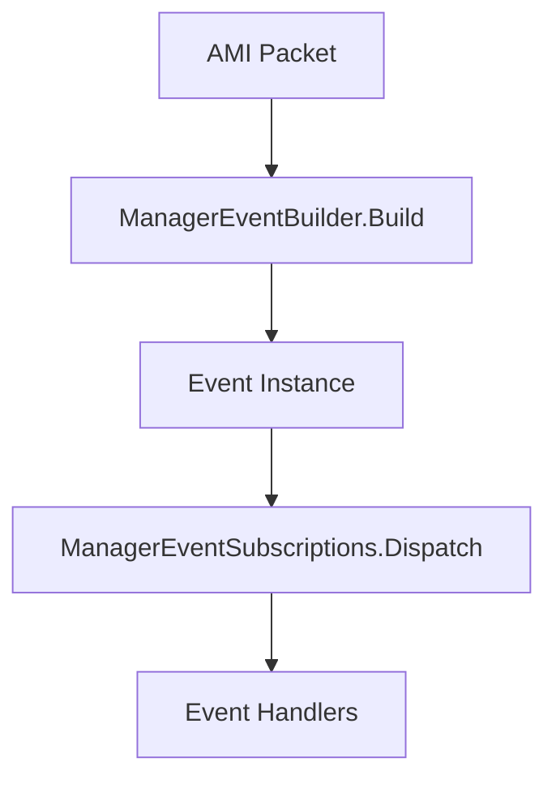

```markdown
# ManagerEventSubscriptions Clean Architecture with Separated Event Building

## Overview

A nova arquitetura implementa uma separação clara de responsabilidades, dividindo a lógica de construção de eventos da lógica de subscription/dispatch. Agora temos duas classes especializadas:

1. **ManagerEventBuilder** - Responsável por construção e parsing de eventos (estático)
2. **ManagerEventSubscriptions** - Responsável por subscriptions e dispatching (instância)

## Problema Original Resolvido

- **"ManagerEventSubscriptions was not properly disposed"** warnings
- **"Event consumer task was canceled gracefully"** durante inicialização
- Conflitos de disposal quando instâncias eram compartilhadas
- Lógica complexa misturada em uma única classe

## Nova Arquitetura: Separação de Responsabilidades

### 1. ManagerEventBuilder (Estático)

**Responsabilidades:**
- Descoberta de tipos de eventos em assemblies
- Registro de classes de eventos 
- Construção de instâncias de eventos a partir de packets AMI
- Parsing de Action IDs e processamento de atributos
- Cache de construtores para performance

```csharp
// Exemplo de uso
var eventObject = ManagerEventBuilder.Build(packet);
var eventKey = ManagerEventBuilder.GetEventKey<SomeEvent>();
ManagerEventBuilder.RegisterUserEventClass(typeof(CustomEvent));
```

**Características:**
- Thread-safe e otimizado para performance
- Cache global de tipos descobertos
- Métodos utilitários para diagnóstico
- Sem estado de instância (totalmente estático)

### 2. ManagerEventSubscriptions (Instância)

**Responsabilidades:**
- Gerenciamento de subscriptions de eventos
- Dispatching de eventos para handlers
- Producer-consumer pattern com channels
- Lifecycle management (disposal)

```csharp
// Exemplo de uso
var subscription = events.On<SomeEvent>(OnSomeEvent);
events.Dispatch(sender, eventInstance);
events.FireAllEvents = true;
```

**Características:**
- Clean disposal behavior (sem complexidade de ownership)
- High-performance event dispatching
- Suporte a handlers abstratos e específicos
- Gestão automática de cleanup

## Fluxo Completo de Eventos



### Implementação no ManagerConnection

```csharp
// No ProcessPacketQueueAsync
if (packet.ContainsKey("event"))
{
    // 1. Build using static builder
    var eventObject = ManagerEventBuilder.Build(packet);
    
    // 2. Dispatch using active subscription system
    if (eventObject != null)
        _activeEvents.Dispatch(this, eventObject.Event);
}
```

## Benefícios da Separação

### ? **Separation of Concerns**
- **ManagerEventBuilder**: Foca em construção e parsing
- **ManagerEventSubscriptions**: Foca em subscription e dispatch
- Cada classe tem uma responsabilidade bem definida

### ? **Performance Otimizada**
- Cache global de tipos (não duplicado por instância)
- Constructors cachados estaticamente
- Menos overhead de memory por conexão

### ? **Facilidade de Manutenção**
- Lógica de building centralizada e testável
- Subscription logic isolado e reutilizável
- Menos complexidade em cada classe

### ? **Flexibilidade**
- Event building pode ser usado independentemente
- Subscription system pode ser usado com qualquer fonte
- Extensibilidade clara para novos tipos de eventos

### ? **Debugging e Diagnostics**
- Métodos específicos para diagnóstico em ManagerEventBuilder
- Logs separados para building vs dispatching
- Estatísticas sobre tipos registrados

## Métodos de Diagnóstico

```csharp
// Verificar quantos tipos estão registrados
int count = ManagerEventBuilder.RegisteredEventClassCount;

// Ver todos os event keys registrados
var keys = ManagerEventBuilder.RegisteredEventKeys;

// Verificar se um tipo específico está registrado
bool registered = ManagerEventBuilder.IsEventKeyRegistered("hangup");
```

## Cenários de Uso

### Cenário 1: Conexão Individual
```csharp
var connection = new ManagerConnection(parameters);
// Usa eventos internos automaticamente
// ManagerEventBuilder é usado transparentemente para build
// ManagerEventSubscriptions gerencia subscriptions
```

### Cenário 2: Serviço Compartilhado (AMIService)
```csharp
// AMIService cria subscription compartilhado
var sharedEvents = new ManagerEventSubscriptions();

// Conexões usam o compartilhado
connection1.Use(sharedEvents, disposable: false);
connection2.Use(sharedEvents, disposable: false);

// ManagerEventBuilder permanece global e compartilhado
```

### Cenário 3: Custom Event Registration
```csharp
// Registrar globalmente (afeta todos)
ManagerEventBuilder.RegisterUserEventClass(typeof(MyCustomEvent));

// Ou registrar em uma instância específica
events.RegisterUserEventClass(typeof(MyCustomEvent)); // delega para builder
```

## Comparação: Antes vs Depois

### Antes (Monolítico)
```csharp
public class ManagerEventSubscriptions
{
    // Building logic mixed with subscription logic
    public static ManagerEventGeneric Build(...)
    public IDisposable On<T>(...)
    public void Dispatch(...)
    
    // Complex ownership tracking
    private static Dictionary<string, ConstructorInfo> _registeredEventClasses;
    private ConcurrentDictionary<string, ManagerInvokable> _handlers;
}
```

### Depois (Separado)
```csharp
public static class ManagerEventBuilder
{
    // Pure building and parsing logic
    public static ManagerEventGeneric Build(...)
    public static void RegisterUserEventClass(...)
    public static string GetEventKey(...)
}

public class ManagerEventSubscriptions
{
    // Pure subscription and dispatching logic
    public IDisposable On<T>(...)
    public void Dispatch(...)
    // Clean disposal without ownership complexity
}
```

## Resultados

- **Zero warnings** de disposal inadequado
- **Zero conflitos** de ownership
- **Código mais modular** e fácil de entender
- **Performance melhorada** com cache global
- **Facilidade de testes** com responsabilidades separadas
- **Extensibilidade** para futuras funcionalidades

A nova arquitetura resolve completamente os problemas originais e fornece uma base sólida e maintível para o sistema AMI, seguindo princípios de design limpo e separação de responsabilidades.
```